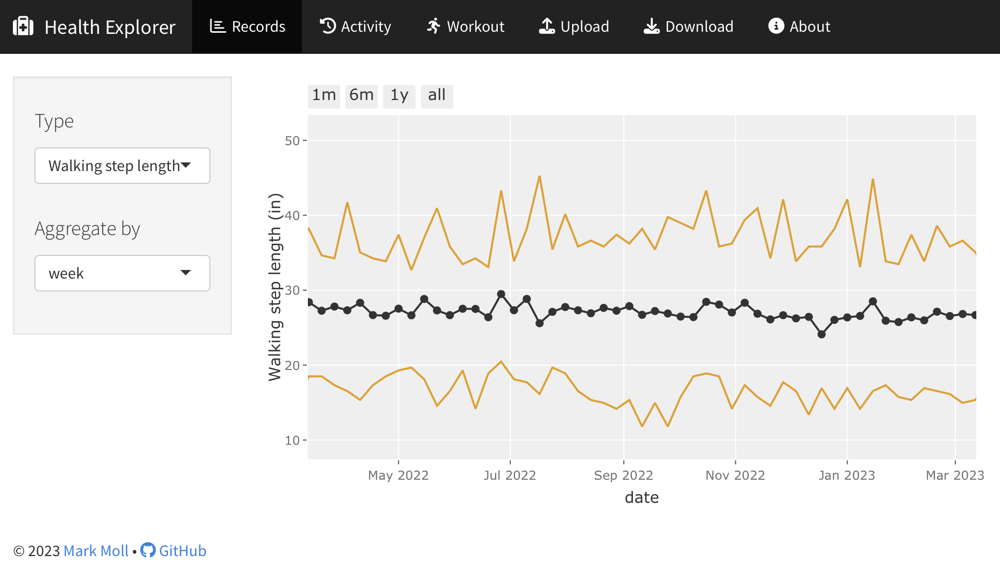

# Healthplotr

This package is primarily an [R Shiny app](https://shiny.rstudio.com/) to visualize Apple Health data that has been exported via the iOS Health app to a file called `export.zip`. See the section "Share your health and fitness data in XML format" in [this Apple support page](https://support.apple.com/guide/iphone/share-your-health-data-iph5ede58c3d) for instructions on how to create this file. The exported zip file can then be uploaded to the Healthplotr Shiny app (and downloaded as an RDS file).

<div style="text-align: center">

</div>

## Getting Started

* Install the `devtools` package:
  ```r
  install.packages(devtools)
  ```
* Install the `healthplotr` package like so:
  ```r
  devtools::install_github("mamoll/healthplotr")
  ```
* Start the `healthplotr` Shiny app:
  ```r
  healthplotr::healthplotr()
  ```
* Optionally, `healthplotr::healthplotr` can be started with some initial data:
  ```r
  # Load data from exported Apple Health zip file
  healthplotr::healthplotr("export.zip")
  # Load data from an RDS file downloaded from a previous healthplotr session
  healthplotr::healthplotr("healthdata.rds")
  # The previous two commands can be separated into two steps each:
  # 1. Load the data into a list of tibbles
  # 1a. Directly from a zip file
  healthdata <- healthplotr::load_exported_health_data("export.zip")
  # 1b. By loading data from an RDS file downloaded from a previous healthplotr session
  healthdata <- readRDS("healthdata.rds") 
  # 2. start the Shiny app with data that has already been loaded
  healthplotr::healthplotr(healthdata)
  ```

Besides the core Shiny app functionality, you may also be interested in using the core helper functions on their own:

* `load_exported_health_data(zip_file)`: load Apple Health data stored in `export.zip` and return a list with 3 tidy tibbles of records, activity, and workout data.
* `plot_records(records, type, aggregate)`: return a plotly object with a plot of records of a certain type (e.g., "BodyMass"), aggregated by a time period (e.g., "month").
* `plot_activity(activity, type, aggregate)`: return a plotly object with a plot of activity of a certain type (e.g., "activeEnergyBurned"), aggregated by a time period (e.g., "month").
* `plot_workout(workout, aggregate)`: return a ggplot object with a plot of all workout durations, aggregated by a time period (e.g., "month").
